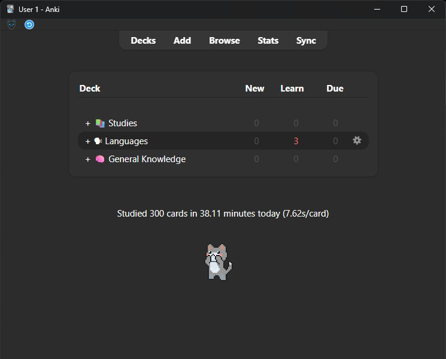
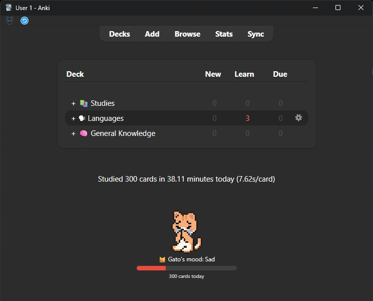
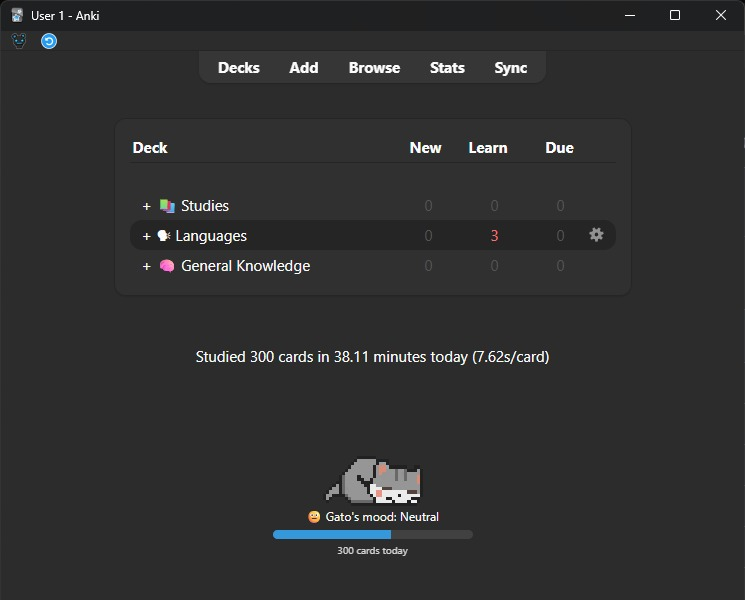
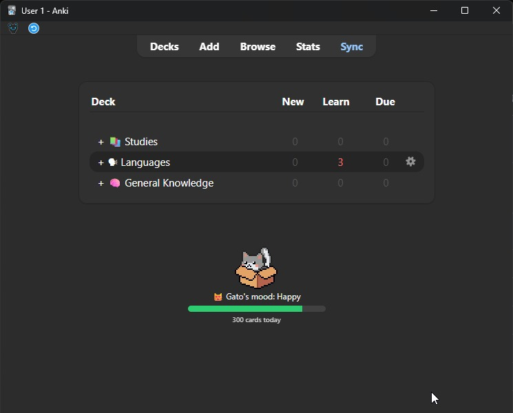
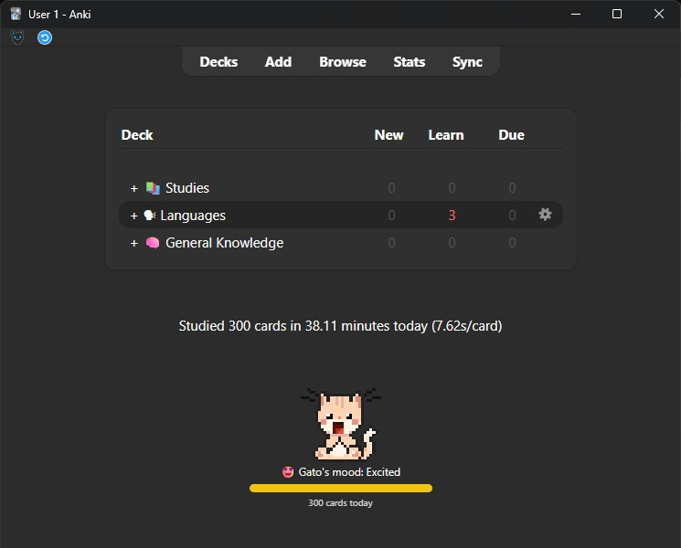
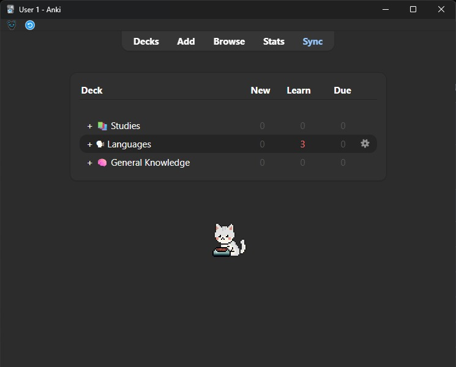
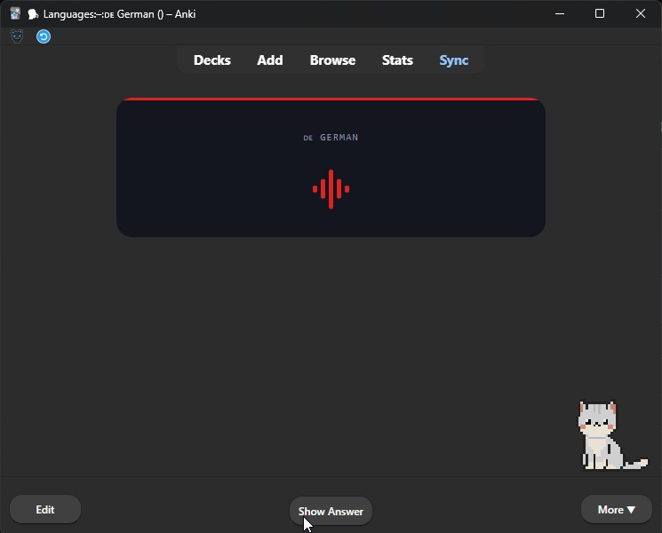
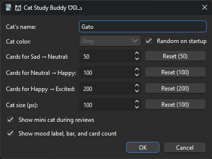

# 🐱︎ Cat Study Buddy ᗢᘏᓗ
*By Icaro Kuchanovicz*

A really simple, tiny pixel-art cat that lives on your Anki deck browser and reacts to how much you study, purely on today's card count. In my opinion just like the light motivation of Review Heatmap: no sounds, no popups, no rewards to manage, just a small sprite quietly nudging you to keep going.

## Features

- **5-stage mood ladder:** Empty → Sad → Neutral → Happy → Excited, based purely on today's card count, resetting every day. Each mood has its own color and animation set (Empty even plays "sick"/"dead" poses).
- **Mood shown as a colored progress bar** toward the next stage.
- **Mini cat during review:** sits in the corner, idle between cards, with a happy pose when you get a card right and a rougher pose on Again.
- **Pick a name and color:** `classical` (cream), `orange`, `grey`, or `white`, or let the color re-roll randomly every time Anki starts.
- **Adjustable sprite size** and your own thresholds for each mood change.
- **Reset-to-default** on every numeric setting.
- A native settings dialog through "**Tools → 🐱︎ Cat Study Buddy ᗢᘏᓗ Settings…**" (no manual JSON editing needed)
- No ads, no tracking, no sound.

## Screenshots

**Cat on the main screen** - Sits quietly below your deck list:

**Mood climbs through 5 stages based on today's card count** - Empty, Sad, Neutral, Happy, Excited, each with its own color and animation set:

| Sad | Neutral |
|---|---|
|  |  |

| Happy | Excited |
|---|---|
|  |  |

**Random action animations** - Once Happy, the cat also plays extra idle actions like eating, napping in a box, or a bath:

**Mini cat during review** - Idles between cards and reacts to your answer:
  > You can deactivate it if you want

**Settings dialog:**

## Installation

**From AnkiWeb:** *[Anki Shared Addons](https://ankiweb.net/shared/info/94808647)*  
**Code:** `94808647`

---

☕ *If this addon helped you, [buy me a coffee](https://buymeacoffee.com/kucha)* 😃

---

## Configuration

Open **Tools → Cat Study Buddy Settings…** for a checkbox/dropdown UI, or edit the config directly via **Tools → Add-ons → Config**:

| Option | Default | Description |
|---|---|---|
| `pet_name` | `Mochi` | Your cat's name. |
| `pet_color` | `classical` | One of `classical` (cream), `orange`, `grey`, `white`. |
| `pet_color_random` | `false` | Re-roll `pet_color` to a random one of the four every time Anki starts (and immediately when checked in settings). |
| `mood_neutral_at` | `50` | Cards/day where mood moves from Sad to Neutral. |
| `mood_happy_at` | `100` | Cards/day where mood moves from Neutral to Happy. |
| `mood_excited_at` | `200` | Cards/day where mood moves from Happy to Excited. |
| `sprite_size` | `100` | How big the cat renders, in pixels. |
| `show_during_review` | `true` | Show the mini cat in the corner during reviews. |
| `show_mood_bar` | `true` | Show the mood label, bar, and today's card count. |

## License

MIT - see [LICENSE](LICENSE).

---

  

